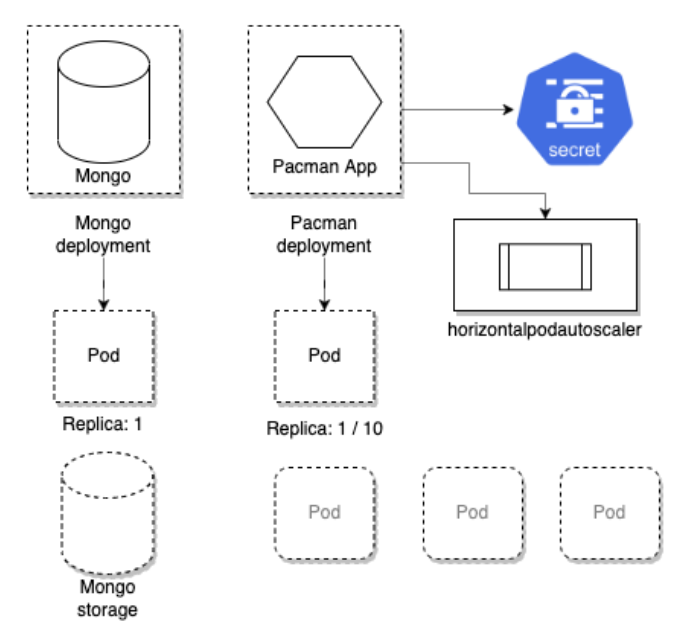
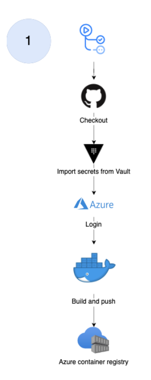
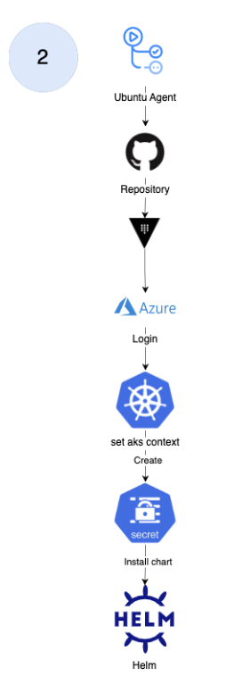
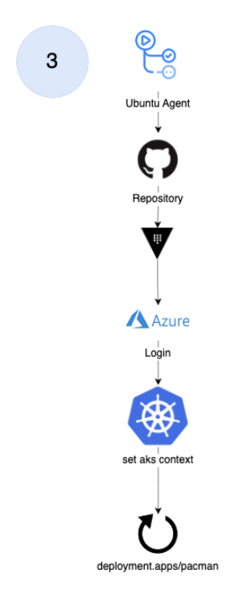
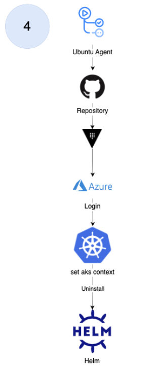

# pacman
Pac-Man App Documentation

- [pacman](#pacman)
  - [Architecture](#architecture)
  - [Terraform and Azure](#terraform-and-azure)
  - [Ansible and Vault](#ansible-and-vault)
  - [Kubernetes, helm and pipelines](#kubernetes-helm-and-pipelines)
  - [Kubernetes namespace diagram](#kubernetes-namespace-diagram)
  - [Kubernetes diagram](#kubernetes-diagram)
  - [Image deploy](#image-deploy)
  - [Deploy to Kubernetes cluster](#deploy-to-kubernetes-cluster)
  - [Restart deployment](#restart-deployment)
  - [Uninstalling of deployment](#uninstalling-of-deployment)

## Architecture

---

## Terraform and Azure

---

## Ansible and Vault

---

## Kubernetes, helm and pipelines

## Kubernetes namespace diagram

Set up of a Kubernetes cluster to deploy an application that consists of two fundamental elements, a mongo db pod and nodejs pod. The pods contain, as the name says it, a container. In a a level above we have a cluster that is set up in the cloud.

## Kubernetes diagram

## Image deploy

## Deploy to Kubernetes cluster

## Restart deployment

## Uninstalling of deployment

